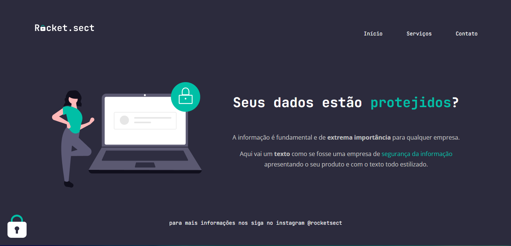

# Desafio Avançado 0.1

## 💪Desafio

O desafio se consiste em realizar um layout apartir dos conhecimentos adiquiridos durante a trajetória atual, utilizando de HTML e CSS.

O layout pode ser acessado [aqui](https://www.figma.com/file/EdKjPWjC8ZlbnH4XzTObv2/Explorer?node-id=16%3A106).

## 🔧 Tecnologias

* HTML5
* CSS

## 📄Licensa

Este projeto está sob a licença do MIT. Consulte o arquivo LICENSE para obter mais detalhes.